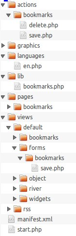

### version 1.8

Emmanuel Salomon  
Juillet 2013


## Un framework hybride

**Drupal, eZ Publish** : content management framework

**Wordpress, Joomla, Spip** : content management system

**Elgg** : ? un framework et un réseau social prêt à l'emploi : blog, wiki, micro-blog, social bookmarking...  
<br/>
But de Ben Werdmuller :
_« Elgg should do nothing »_


## Elgg

Créer en 2004. Utilisé par :  
NASA, UNESCO, Oxfam, Gouvernements Australien, Anglais et Cannadien, +1000 universités...

- Open source GPLv2 (créer par Curverider, maintenu par Elgg Foundation)
- Basé sur LAMP (Apache, nginx, node.js...)
- MVC, ORM, ACL, i18n, API, webservices, OAuth
- Vues RSS, XML, JSON, mobile, iphone, print...

- Développement sur github [https://github.com/Elgg/Elgg]()
  - ~10 000 commits
  - 41 contributeurs (dont moi :)  


## Extensible

**API :**

- Overriding
- hooks
- Extend view
- Class

**Frameworks :**

- php
- css
- javascript


## Installation

- git checkout 1.8.16
- .htaccess (RewriteBase /sites/Elgg/)
- cron ([http://docs.elgg.org/wiki/Cron]())

<br>Pour le développement :

- activer le plugin elgg developer tools
- désactiver les caches
- elgg_log(), elgg_dump(), wrappers


### Afficher/obtenir des objets

```
get_entity();
elgg_get_logged_in_user_entity();

elgg_get_entities(array(
	'type' => 'object',
	'subtype' => 'user'
));

elgg_list_entities_from_*();
```


### Extensible
```
elgg_list_entities(array(
	'type' => 'object',
	'subtype' => 'bookmarks',
	'owner_guid' => 'XXX',
	'container_guid' => 'XXX',
	'joins' => "JOIN {$dbprefix}entities e ON e.guid = rv.object_guid",
	'wheres' => "e.container_guid = " . elgg_get_page_owner_guid(),
	'full_view' => false,
	'view_toggle_type' => false,
));
```


## Modèle d'un template




## xml
```xml
<?xml version="1.0" encoding="UTF-8"?>
<plugin_manifest xmlns="http://www.elgg.org/plugin_manifest/1.8">
	<name>Blog</name>
	<author>Core developers</author>
	<version>1.8</version>
	<category>bundled</category>
	<blurb>Blog plugin</blurb>
	<description>Adds simple blogging capabilities to your Elgg installation.</description>
	<website>http://elgg.org/</website>
	<copyright>See COPYRIGHT.txt</copyright>
	<license>GNU General Public License version 2</license>
	<requires>
		<type>elgg_release</type>
		<version>1.8</version>
	</requires>
	<activate_on_install>true</activate_on_install>
</plugin_manifest>
```


## start.php

On déclare :

```
elgg_register_event_handler('init', 'system', 'monplugin_init');

function monplugin_init() {
	elgg_register_library();
	elgg_register_js();
	elgg_load_js();

	elgg_register_page_handler();
	elgg_register_action();

	elgg_register_menu_item('site'
	elgg_register_plugin_hook_handler('register', 'menu:page'

	elgg_extend_view('css/elgg', 'bookmarks/css');
	elgg_extend_view('js/elgg', 'bookmarks/js');

	elgg_register_widget_type();

	elgg_register_entity_type('object', 'bookmarks');
	elgg_register_entity_url_handler();
}
```


## handler
```
function bookmarks_page_handler($page) {

	elgg_load_library('elgg:bookmarks');

	elgg_push_breadcrumb(elgg_echo('bookmarks'), 'bookmarks/all');
```


## hooks
```
elgg_register_plugin_hook_handler($hook, $type, $callback, $priority = 500)
elgg_trigger_plugin_hook($hook, $type, $params = null, $returnvalue = null)

elgg_register_event_handler($event, $object_type, $callback, $priority = 500)
elgg_trigger_event($event, $object_type, $object = null)
```


## Les pages et vues
```
elgg_pop_breadcrumb();
elgg_push_breadcrumb();

elgg_view()
elgg_register_title_button();
elgg_view_form();
get_input();
```


## actions et formulaires
```
elgg_register_action();
elgg_trigger_plugin_hook('action', $action, null, $event_result);

elgg_clear_sticky_form('blog');
add_to_river();
```


## cron
```
elgg_register_plugin_hook_handler('cron', 'hourly', 'monplugin_cron');
```


## webservices
```
expose_function("test.echo",
	"my_echo",
	array("string" => array('type' => 'string')),
	'A testing method which echos back a string',
	'GET',
	false,
	false
);
```
```
<elgg>
	<status>0</status>
	<result>testing</result>
</elgg>
```


# CSS

- override
- helpers
  - hidden, float, link, center
  - mas, mhm, pbl


## jQuery
** helpers**
```
elgg.isNull, elgg.isArray, elgg.isString, elgg.isFunction...
elgg.normalize_url, elgg.parse_url, elgg.parse_string...
```

**php like :**
```
elgg.system_message, elgg.echo
elgg.register_hook_handler
elgg.trigger_hook
elgg.get_logged_in_user_entity
elgg.is_logged_in
```

**ajax :**
```
elgg.action()
elgg.post()
elgg.get()
elgg.api()
```


## UI
```
[rel=toggle]
[rel=popup]
.elgg-requires-confirmation (rel: question, confirm())
.elgg-autofocus

```


## Elgg 1.9 ?

- Mobile friendly
- ElggComment
- AMD (Asynchronous Module Definition)
- Angular.js ?
- elgg.view()
- Performances, + extensible